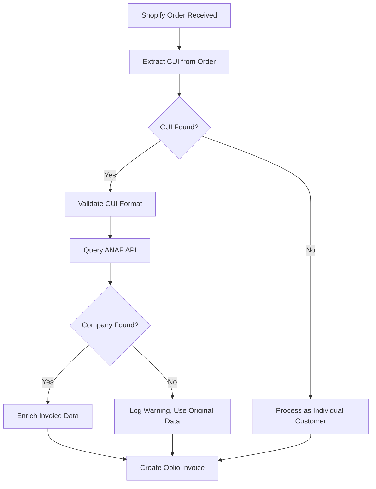

# ANAF Integration Documentation

## Overview

The ANAF (Agenția Națională de Administrare Fiscală) integration provides automatic Romanian company verification and data enrichment for the Oblio invoicing system. When a Shopify order contains company information (CUI/CIF), the system automatically verifies the company with ANAF and enriches the invoice with official company data.

## Features

### 🏢 Company Verification
- Automatic CUI/CIF validation and normalization
- Real-time company verification with ANAF database
- VAT payer status verification
- Company activity status (active/inactive)
- E-Invoice registration status

### 📊 Data Enrichment
- Official company name and registration details
- Complete address information (fiscal and social)
- Contact information (phone, fax)
- Tax status and VAT information
- Registration numbers and legal forms

### 🔄 Seamless Integration
- Automatic detection of company data in Shopify orders
- Fallback to individual customer processing if no company data
- Error handling with graceful degradation
- Rate limiting compliance with ANAF requirements

## How It Works

### 1. Order Processing Flow



### 2. CUI Detection Sources

The system looks for company CUI/CIF in multiple order fields:

- **Billing Address Company Field**: `order.billing_address.company`
- **Shipping Address Company Field**: `order.shipping_address.company`
- **Note Attributes**: Custom fields with names containing 'cui' or 'cif'
- **Customer Notes**: Order notes containing CUI patterns
- **Line Item Properties**: Product-level custom properties

### 3. CUI Pattern Recognition

The system recognizes various CUI formats:
- `RO37311090` (with RO prefix)
- `37311090` (numeric only)
- `CUI: 37311090` (with label)
- `CIF 37311090` (alternative label)

## API Integration

### ANAF Web Service Details

- **Endpoint**: `https://webservicesp.anaf.ro/api/PlatitorTvaRest/v9/tva`
- **Method**: POST
- **Content-Type**: application/json
- **Rate Limit**: 1 request per second, max 100 CUI per request

### Request Format

```json
[
  {
    "cui": 37311090,
    "data": "2024-01-15"
  }
]
```

### Response Format

```json
{
  "cod": 200,
  "message": "SUCCESS",
  "found": [
    {
      "date_generale": {
        "cui": "37311090",
        "denumire": "OBLIO SOFTWARE SRL",
        "adresa": "Str. Example 123, Bucuresti",
        "nrRegCom": "J40/1234/2020",
        "telefon": "0212345678",
        "statusRO_e_Factura": true
      },
      "inregistrare_scop_Tva": {
        "scpTVA": true
      },
      "stare_inactiv": {
        "statusInactivi": false
      }
    }
  ],
  "notFound": []
}
```

## Usage Examples

### Basic Company Verification

```javascript
import AnafService from '../services/AnafService.js';

const anafService = new AnafService();

// Verify single company
const company = await anafService.verifyCompany('RO37311090');
const companyInfo = anafService.extractCompanyInfo(company);

console.log(companyInfo.name); // "OBLIO SOFTWARE SRL"
console.log(companyInfo.vatPayer); // true
console.log(companyInfo.inactive); // false
```

### Batch Verification

```javascript
// Verify multiple companies
const results = await anafService.verifyCompanies(['37311090', '12345678']);

console.log(`Found: ${results.found.length}`);
console.log(`Not found: ${results.notFound.length}`);
```

### Oblio Integration Format

```javascript
// Get company data formatted for Oblio
const oblioCompany = await anafService.getCompanyForOblio('37311090');

// Use in invoice creation
const invoiceData = {
  cif: 'RO37311090',
  client: oblioCompany,
  products: [...],
  // ... other invoice data
};
```

### VAT Status Check

```javascript
// Quick VAT payer verification
const isVATActive = await anafService.isVATPayerActive('37311090');

if (isVATActive) {
  console.log('Company is an active VAT payer');
}
```

## Configuration

### Environment Variables

No additional environment variables are required for ANAF integration. The service uses the public ANAF API endpoint.

### Rate Limiting

The service automatically handles ANAF rate limiting:
- Maximum 1 request per second
- Maximum 100 CUI per request
- Automatic delays between requests

## Error Handling

### Graceful Degradation

When ANAF verification fails:
1. The system logs a warning
2. Original order data is preserved
3. Invoice creation continues with available data
4. CUI is still included if detected

### Common Error Scenarios

- **Network Issues**: Automatic retry with exponential backoff
- **Invalid CUI**: Validation error with clear message
- **Company Not Found**: Warning logged, processing continues
- **Rate Limiting**: Automatic delay and retry

## Testing

### Running Tests

```bash
# Run ANAF service tests
node _tests/anaf-test.js
```

### Test Coverage

The test suite covers:
- Single company verification
- Batch verification
- CUI validation
- Oblio format conversion
- VAT status checking
- Error handling scenarios

## Shopify Order Examples

### Order with Company in Billing Address

```json
{
  "id": 12345,
  "billing_address": {
    "company": "OBLIO SOFTWARE SRL - RO37311090",
    "first_name": "John",
    "last_name": "Doe"
  }
}
```

### Order with CUI in Note Attributes

```json
{
  "id": 12345,
  "note_attributes": [
    {
      "name": "CUI Firma",
      "value": "37311090"
    }
  ]
}
```

### Order with CUI in Customer Note

```json
{
  "id": 12345,
  "note": "Factura pentru firma cu CUI: RO37311090"
}
```

## Benefits

### For Businesses
- **Compliance**: Automatic verification ensures accurate company data
- **Efficiency**: Eliminates manual data entry for company invoices
- **Accuracy**: Official ANAF data reduces errors
- **E-Invoice Ready**: Automatic detection of e-invoice capable companies

### For Developers
- **Robust**: Comprehensive error handling and fallbacks
- **Scalable**: Batch processing and rate limiting
- **Maintainable**: Clean separation of concerns
- **Testable**: Comprehensive test coverage

## Troubleshooting

### Common Issues

1. **CUI Not Detected**
   - Check order data structure
   - Verify CUI format in source fields
   - Review extraction patterns

2. **ANAF API Errors**
   - Check network connectivity
   - Verify rate limiting compliance
   - Review ANAF service status

3. **Data Enrichment Failures**
   - Check company exists in ANAF database
   - Verify CUI format and validity
   - Review error logs for details

### Debug Logging

Enable detailed logging to troubleshoot issues:

```javascript
// The service automatically logs:
// - CUI detection attempts
// - ANAF API requests
// - Verification results
// - Error conditions
```

## Future Enhancements

- Caching of ANAF responses to reduce API calls
- Webhook notifications for company status changes
- Integration with other Romanian fiscal services
- Advanced CUI detection patterns
- Company data validation and updates
